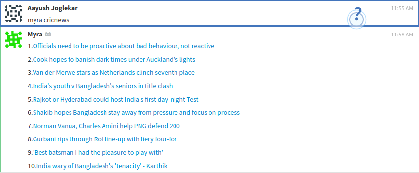
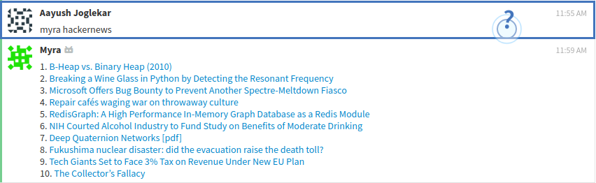
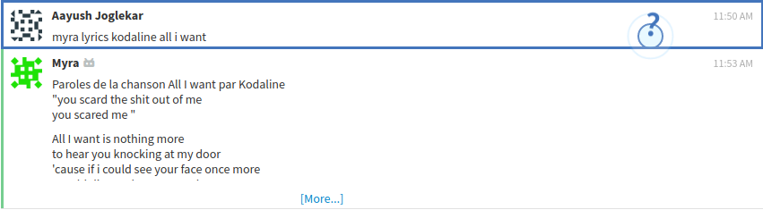
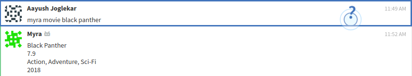
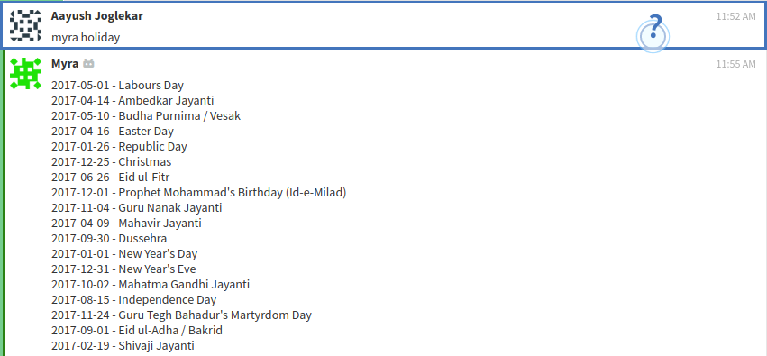
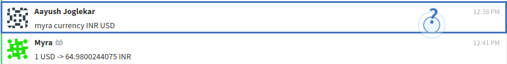

# Welcome to Myra Bot!


## **Myra Bot** is a zulip chatbot   


# Instructions to run locally:
1. [Create a Zulip Realm](https://zulip.com/create_realm/)
2. Goto to settings and create a new generic bot named 'myra'. (Settings can be found in dropdown of gear icon present in top right corner of zulip realm)
3. Download the zuliprc file for your bot and place it in your home directory as '.zuliprc'.
  
4. Install all the requirements using ``` pip install -r requirements.txt ```
5. In ``` bot.py ``` , change site in ``` self.client = zulip.Client(site="https://myra.zulipchat.com/api/") ``` to url of your created zulip realm.Do the same for ``` BOT_MAIL ``` variable.  
6. Run ``` bot.py ``` using python 3. ``` python3 bot.py ```
7. Head over to your created zulip realm and start using the bot.

# Features

Myra Bot can :
>
>* Translate any language
>* Get top news from HackerNews
>* Find the lyrics to any song
>* Get realtime currency conversion rates
>* Find details of your favourite movie
>* Find the list of holidays
>* Stay updated with cricket scores

## How to use?

 

###  Translate:
Translate messages received in different languages using out Zulip translate integration.  
`myra translate "any language"` 

  

###  HackerNews:
Get top 10 stories of hackernews in no time in your Zulip server.  
`myra HN`  

    

### Cricket Scores:
Know all about cricket scores without leaving Zulip.  
`myra cricnews`  


  

### Lyrics:
Find the lyrics to your fav song and jam to the beats!  
`myra lyrics "artist" "song"`  


 

### Movie:
Find the details to your fav movie !  
`myra movie "title"`  


 

### Holidays:
Find the list of all the holidays!  
`myra holiday `  


 

### Currency:
Get the realtime conversion rates!  
`myra currency "curr1" "curr2"`  


 

 
